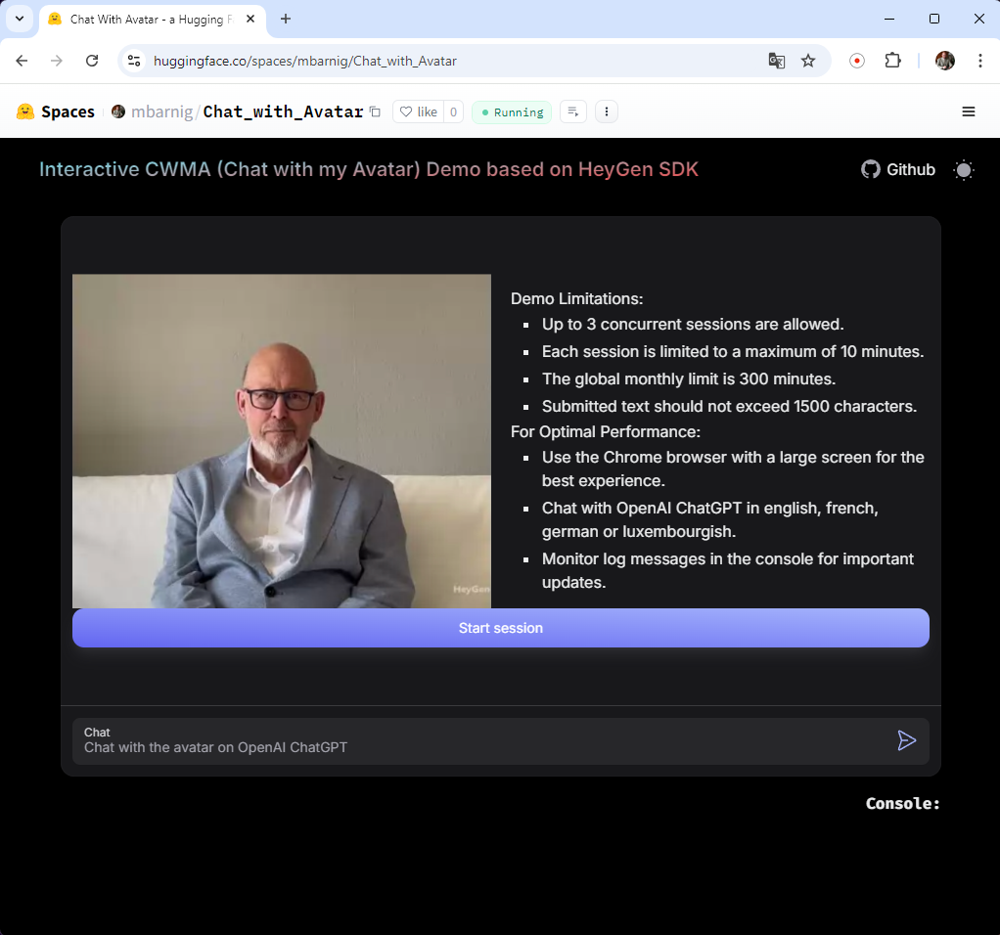

# Chat with my Avatar

HeyGen Interactive Avatar with multilingual TTS and OpenAI ChatGPT interface
The primary purpose of this customized version is to define specific instructions and assign a particular role (such as engineer, journalist, scientist, salesperson, or teacher) to ChatGPT at initialization. This setup ensures that responses are short, concise, and optimized for quick vocal delivery.
